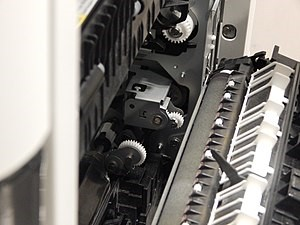

# Actuatoren
***
## 1. Wat is een actuator?
Het woord *actuator* komt van het Engelse *act*, wat *handelen* of *doen* betekent. Een actuator is dus een apparaat wat iets **doet** of iets in **actie** zet. Het kan invloed uitoefenen op zijn omgeving, zoals een beweging veroorzaken.
Een actuator wordt vaak samen gebruikt met een sensor, de sensor registreert iets en de actuator doet daar iets mee.

## 2. Hoe werkt een actuator en wat doet het?
Een compleet systeem om iets waar te nemen en vervolgens op deze waarnemingen te reageren, bestaat uit deze drie onderdelen:
* De **sensor**: dit is de ingang van het systeem. Door middel van een automatische werkwijze (mechanisme) wordt er een waarneming gedaan. Deze waarneming kan bijvoorbeeld de omgevingstemperatuur zijn. De uitgang van dit onderdeel kan een **analoog** of een **digitaal** signaal zijn.
* De **regelaar**: hierbij wordt gewerkt met microprocessoren of digitale signaalprocessoren. Een microprocessor bevat de geïntegreerde schakeling van een computer op één chip. Een digitale signaalprocessor is een microprocessor speciaal ontworpen voor het bewerken van digitale signalen/waarden.
* De **actuator**: de actuator voert de analoge of digitale bewerking uit.

Neem jezelf als voorbeeld om te begrijpen hoe het werkt. Je zit aan tafel en het begint verbrand te ruiken. Dit signaal wordt doorgegeven aan je hersenen *(= sensor)* en daarna bedenk je je dat de pizza in de oven aan het aanbranden is. Je komt in beweging om snel naar de oven te gaan de pizza er uit te halen *(= actuator)*. Dit zijn allemaal actuatoren die in actie komen, doordat je zintuigen van alles waarnemen.
Een praktisch voorbeeld om dit stappenproces te verduidelijken. Zo een systeem bestuurt een verwarming van een lokaal. Stel, bij een temperatuur lager dan 20°C moet dit systeem de verwarming inschakelen, en bij hoger dan 25°C uitschakelen:

* De sensor is hier een thermistor. Dit is een elektrische component waarvan de elektrische weerstand afhankelijk is van de temperatuur. Je bekomt een analoog signaal dat de temperatuur voorstelt.
* Vervolgens wordt dit analoge signaal door een analoog-digitaalomzetter (A/D-converter)  gestuurd die het analoge signaal omzet naar digitale waarden.
* De processor vergelijkt dan deze digitale waarden met de gewenste waarden. Indien de temperatuur, door de sensor waargenomen, lager ligt dan de gewenste waarde, dan zal de processor een signaal uitsturen met de waarde ‘1’ om aan te duiden dat de verwarming moet worden ingeschakeld. Indien de processor tot de conclusie komt dat de temperatuur boven de gewenste waarde ligt, dan zal hij een digitaal signaal met de waarde ‘0’ uitsturen.
* De D/A-convertor zal het digitale signaal van de processor, met de waarde ‘1’ of ‘0’, terug omzetten naar een analoog signaal, waarmee de actuator kan worden aangestuurd.
* De laatste stap in dit proces is de actuator. In dit geval kan deze bijvoorbeeld een schakelaar zijn die het aan- en uitschakelen van de verwarming regelt.

## 3. Soorten
Actuator is een ruim begrip, dit betekent dus ook dat er veel soorten actuatoren bestaan. Deze worden onderverdeeld in twee subcategorieën: de **lineaire** en de **rotatieve** actuatoren. Een lineaire actuator creëert een beweging in een rechte lijn. Een rotatieve actuator maakt roterende bewegingen. Hieronder een overzicht van de verschillende soorten actuatoren:

* Lineaire actuatoren:
	* Piëzo-elektrische actuatoren
	*	Elektromagnetische actuatoren
	*	Hydraulische actuatoren
	*	Pneumatische actuatoren
* Rotatieve actuatoren
	* Servomotoren

### 3.1	Piëzo-elektrische actuatoren
In dit type actuator is er een kristal aanwezig, dat door middel van spanning of druk een beweging opwekt. Die trilling die het kristal veroorzaakt kan worden gebruikt om een kleine beweging te creëren, zoals in een keramische luidspreker.

### 3.2	Elektromagnetische actuatoren
Deze actuatoren werken op basis van een elektromagneet (gedraagt zich onder invloed van elektrische stroom als een magneet). Door een elektrische stroom door een spoel te sturen, ontstaat een magnetisch veld die een kracht uitoefent.

### 3.3	Hydraulische actuatoren
Bij deze soort wordt er een vloeistof gebruikt, dat vervolgens door middel van (meestal) druk, een voorwerp kan verplaatsen. Er zijn twee manieren op dit op te bouwen:
* De vloeistoffen zijn gevoelig voor temperatuur, druk, elektrische stroom, enzovoort waardoor deze uitzetten of krimpen.
* De vloeistoffen worden aangedreven onder hoge druk (hydrauliek).

### 3.4	Pneumatische actuatoren
Bij deze soort wordt perslucht gebruikt, door middel van druk kan het een voorwerp verplaatsen.

### 3.5	Servomotoren
Dit apparaat regelt automatisch een mechanisch systeem, zonder directe mechanische verbinding.

## 4. Voorbeelden en toepassingen
Er kunnen verschillende soorten acties ontstaan. Er kan bijvoorbeeld een motor worden aangezet of een beweging in gang gezet worden of veranderen. Bijvoorbeeld de tandwielen in een kopieerapparaat zijn actuators.

## 5. Actuatoren vs. Sensoren
Een actuator is precies wat een sensor niet is, dus ook de werking is tegengesteld. Een sensor neemt een signaal waar, en geeft dat door. Een actuator maakt gebruik van dat signaal om zijn omgeving te beïnvloeden, dus het omzetten in een **handeling**. Deze handeling kan bijvoorbeeld een beweging zijn (iets draaien of verplaatsen), maar er kan ook ergens spanning opgezet worden. Hierdoor kan bijvoorbeeld een geluid te horen zijn of een lamp die gaat branden.
Die beïnvloeding kan onrechtstreeks zijn, zoals bijvoorbeeld een schakelaar om de verwarming te regelen, of een membraam laten trillen bij een luidspreker om geluidsgolven te produceren.

## 6. Bronnen
[Wikipedia - Actuator](https://nl.wikipedia.org/wiki/Actuator)

[Wikipedia - Servomotor](https://nl.wikipedia.org/wiki/Servomotor)

[maken.wikiwijs.nl](https://maken.wikiwijs.nl/120977/Sensoren_en_actuatoren__productieautomatisering_#!page-4165519)
